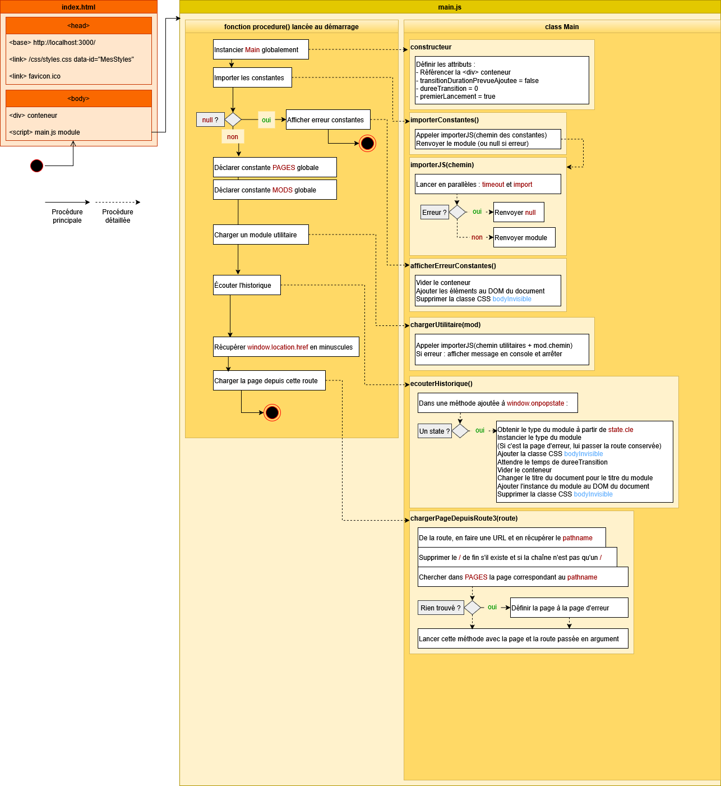

# SmoothModule

## Présentation

Ce programme est un test. Il s'agit de réaliser une application web *client side* codé en Javascript *vanilla* avec un serveur Node sans dépendances. Le programme présente ces fonctionnalités :
- Web Component,
- modules,
- gestion de l'historique du navigateur,
- chargement à la demande (pages, utilitaires) avec gestion d'erreur,
- transition entre pages,
- contrôle des URL affichées en barre d'adresse de navigateur,
- styles CSS globaux et locaux,
- en-têtes de sécurité.

Le programme est destiné à un usage de consultation (pas d'espace d'administration ou de session utilisateur). Exemples : portfolio, module événementiel ou publicitaire, jeu.

## Serveur

Node est requis pour gérer le serveur. J'ai choisi cette technologie pour sa simplicité ; on portera le programme à un autre environnement en respectant le même fonctionnement.

Démarrer le serveur en exécutant une de ces instructions dans un terminal : 

```
node serveur/index.js
```

```
npm start
```

Le dossier `www` et ses contenus doivent être les seules ressources exposées côté client.

La ***Content Security Policy*** empêche les styles et scripts dits *inline*. Ceci vaut également pour les Web Components. Plusieurs solutions existent de complexité variable :
- utiliser des ressources externes, chargées par les composants (solution retenue car simple),
- calculer un hash de chaque style de composant et les ajouter à la liste d'autorisations de la CSP,
- calculer un nonce à chaque requête et l'inscrire dynamiquement dans la CSP et les fichiers JS.

D'un point de vue de l'expérience utilisateur, les adresses ciblant un fichier (JS, CSS...), ne doivent pas être accédées directement par l'utilisateur. Pour cela, le serveur peut analyser le `referer` : si sa valeur est celle attendue, alors le serveur renvoie la ressource ; sinon, le serveur redirige vers une page ou retourne une erreur. Certes, le `referer` peut être modifié, mais c'est dans une optique d'UX et non pas de sécurité que cette fonctionnalité est mise en place.

Voyons plus précisément le cas des fichiers à télécharger. Ce cas est considéré spécifiquement du côté du serveur : si un fichier se trouve dans un certain dossier dédié aux téléchargements (par exemple `www/telechargements`), alors le serveur renvoie la ressource avec les en-têtes nécessaires au navigateur pour que le fichier soit effectivement téléchargé (et non pas simplement lu comme une page HTML par exemple). Il est un cas spécial, les fichiers PDF : le navigateur peut afficher le fichier en plus d'effectuer le téléchargement ; alors, pour le confort d'utilisation, il est préférable de laisser le navigateur afficher le contenu et pour cela il faut placer le fichier dans un autre répertoire (par exemple, `www/ressources`).

Les fichiers sont à renvoyer côté client avec un type MIME adéquat.

Le *charset* des fichiers non multimedia (vidéo, image...) doit être `utf-8`.

Toutes les requêtes qui ne pointent pas sur un fichier doivent retourner le fichier `html/index.html`. Cette page contient la structure minimale du site.

## HTML et CSS

Pour résoudre les chemins vers les ressources, la page d'accueil HTML peut présenter le *tag* `<base>`. Sinon, les liens relatifs doivent commencer par `/`.

La feuille de style globale du site est chargée en `<head>` avec un *tag* `<link>`. Ce *tag* présente un attribut *dataset* `id` pour cibler cette feuille de style. *Dataset* et non pas un attribut `id` : ceci pour éviter tout conflit ultérieur avec le contenu des pages.

Le `<body>` possède :
- une balise `<div>` ayant l'attribut `id="conteneur"` : c'est ici que s'ajouteront les composants de page du site,
- une balise `<script>` chargeant `main.js` avec un type module.

Pour illustrer la transition entre les pages, trois styles CSS sont utilisés :
```CSS
body
{
	background-color: black;
	color: gray;
	
	transition-property: opacity;
	transition-duration: 0s; /* par défaut au lancement de la page */
	transition-timing-function: ease-in-out;
}
.bodyInvisible /* ajoutée au <body> */
{
	opacity: 0;	
}
.bodyTransitionDurationOK /* classe ajoutée en JS par la suite */
{
	transition-duration: 0.3s; 
}
```

Au lancement du site, `transition-duration` est à `0` et `.bodyInvisible` est appliquée au `<body>` : de cette manière, rien n'est visible à l'écran et aucune transition n'est jouée. En effet, si `transition-duration` avait une valeur, alors la transition jouerait jusqu'à obtenir une opacité de 0. Ensuite, une fois que la page demandée (l'accueil) est chargée, alors la `bodyTransitionDurationOK` est ajoutée au `<body>` pour que par la suite la transition entre pages puisse être effective.

## JS

En JavaScript, une fonction déclarée avec des paramètres peut être appelée en utilisant une signature sans paramètres ; dans la fonction, les paramètres sont alors indéterminés. Il n'est donc pas nécessaire de rédiger des surcharges ou des méthodes façades. Maintenant, on peut préférer un appel de fonction qui respecte la signature de la fonction : ceci s'effectue avec des paramètres explicitement `null`.

```JS
let maFonction = (a, b) => console.log(a, b);
maFonction(1, 1); // 1, 1 
maFonction(1); // 1, undefined
maFonction(); // undefined, undefined
```

```JS
maFonction(null, null);
```

Depuis le DOM, un fichier JS peut être chargé à partir du `<head>` ou bien en fin de `<body>`. Le chargement peut aussi être différé. La manière d'exécuter les instructions JS, quelle que soit la situation, doit être choisie :
- instructions écrites en dehors de toute portée : peu importe le chargement de ressources,
- dans une *IIFE (Immediately Invoked Function Expression)* : peu importe le chargement de ressources,
- dans un observateur de l'événement `DOMContentLoaded` : au chargement du HTML seul et hors ressources,
- dans un observateur de l'événement `onload` : au chargement complet (HTML et ressources).

```JS
let procedure = async() =>
{
	...
	await ...
	...
}

// Hors de toute portée 
procedure();

// IIFE
(async () => 
{
	await procedure();
})();

// Ajout d'un observateur
// Autorise l'ajout d'autres observateurs pour le même événement
document.addEventListener('DOMContentLoaded', async () =>
{
	await procedure();	
});

// Ajout d'un observateur
// Un seul observateur pour cet événement
window.onload = async () =>
{
	await procedure();
};
```

## Modules

Les fichiers JS côté *front-end* sont chargés en tant que **modules**.

Les modules sont déjà en mode strict, il est donc inutile d'ajouter `"use strict";` en première ligne de script.

Un script peut être chargé en tant que module et néanmoins ne pas être un module (il n'exporte rien).

Le script principal `main.js` contient une classe `Main` et le code de démarrage du programme. Ce script n'exporte rien mais il doit être chargé en tant que module de façon à ce que les instructions `import`/`export` puissent être disponibles par la suite.

```HTML
<script src="/js/main.js" type="module"></script>
```

La classe `Main` doit être accessible dans tout le programme (car elle fournit les méthodes utiles) et pourtant les modules sont cloisonnés (une variable de module est locale au module, dans la portée du module). Il faut alors rendre la classe globale, grâce à `window`.

```JS
const main = new Main();
window.main = main;
```

Un module peut avoir une entité par défault. Cette fonctionnalité est très utile : sans connaître le type (autrement dit, dans un contexte dynamique), ce type est conservé dans une propriété `default` :

```JS
class MaChose {...}
export default MaChose;
```

```JS
const module = await import('/maChose.js');
const typeModule = module.default; // contient MaChose
const instance = new typeModule(); 
```

L'importation d'un module s'effectue au moyen d'un chemin de fichier. Ce chemin peut être :
- **relatif au fichier appelant** qui effectue l'import, 
- ou bien **absolu** : l'adresse racine peut être définie en HTML avec le *tag* `<base>` pour harmoniser avec les autres ressources.

```JS
import { Toto } from '/toto.js'; // relatif au présent fichier
import { Toto } from '/js/toto.js'; // absolu (racine posée dans <base>)
```

## Charger fichier JS

Charger un fichier JS, de façon disons classique ou traditionnelle, s'effectue en insérant un *tag* `<script>` dans le document HTML et en contrôlant le chargement (délai de dépassement). Voici un exemple qui montre la lourdeur des opérations (DOM manipulé plusieurs fois, code conséquent) :

```JS
chargerFichierJS = async (fichier) =>
{
	const chemin = './js/' + fichier;
	
	if(document.querySelector(`script[src='${chemin}']`))
	{
		console.log(`${chemin} déjà chargé.`);
		return true;
	}
	
	return new Promise((resolve, reject) =>
	{
		const element = document.createElement('script');
		element.src = chemin;
		
		const timeout = setTimeout(() => 
		{
			element.onload = null;
			element.onerror = null;
			element.remove();
			// Version avec reject
			// reject(new Error(`Expiration du chargement de ${chemin}.`));
			// Version avec resolve
			console.log(`Expiration du chargement de ${fichier}.`);
			resolve(false);
		}, 3000); // 3 sec
		
		element.onload = () =>
		{
			clearTimeout(timeout);
			element.onload = null;
			element.onerror = null;
			console.log(`${chemin} est chargé.`);
			resolve(true);
		}
		
		element.onerror = () => 
		{
			clearTimeout(timeout);
			element.onload = null;
			element.onerror = null;
			element.remove();
			// Version avec reject
			// reject(new Error(`Erreur du chargement de ${chemin}.`));
			// Version avec resolve
			console.log(`Erreur du chargement de ${fichier}.`);
			resolve(false);
		}
		
		// Ajouter au DOM déclenche le timeout et l'observation d'événements onload et onerror
		document.body.appendChild(element);
	});
}
```

Utiliser des modules facilite cette étape de chargement de fichier en éliminant la manipulation du DOM. 

```JS
importerJS = async (chemin) =>
{
	try {
		// Créer une promesse qui sera rejetée après le délai spécifié
		const timeout = new Promise((_, reject) => 
		{
			setTimeout(() => reject(new Error("Timeout dépassé")), 3000);
		});
		// Lancer en parallèles l'importation du module et le timeout 
		const module = await Promise.race([
			import(chemin), 
			timeout
		]);
		console.log(module);
		return module;
	} catch (erreur) {
		console.log(erreur);
		return null;
	}
}
```

## Web Components

Web Component est utilisé pour gérer des pages du site. 

**Un élément HTML personnalisé doit être défini dans un registre** au moyen de la méthode `customElements.define()` qui prend en paramètres le nom du composant et le type correspondant (classe JS).

```JS
class Accueil extends HTMLElement {...}
customElements.define('page-accueil', Accueil);
```

Une fois l'élément défini dans le registre, on peut donc réutiliser le type à partir du nom. Le type n'a pas besoin d'être connu pour être utilisé (idem `default` d'un module).

```JS
const typeInstance = customElements.get('page-accueil');
const instance = new typeInstance();
document.body.appendChild(instance);
```

Le contenu HTML d'un Web Component peut être ajouté au *document DOM* ou au *shadow DOM* de deux manières (dans les deux cas, il faut effectuer des contrôles de sécurité si des données sont injectées) : 
- avec l'API `Element` : on peut coder les événements avant d'ajouter les éléments au DOM, l'attachement au *shadow root* peut être en mode `closed`,
- ou bien avec un `template` dont on utilise la propriété `innerHTML` : les événements ne peuvent être codés qu'après l'ajout des éléments au DOM, ce qui implique un attachement au *shadow root* en mode `open` (en `closed`, rien ne serait accessible).

## Historique de navigation

Sources : 
- https://developer.mozilla.org/fr/docs/Web/API/History_API
- https://developer.mozilla.org/en-US/docs/Web/API/History/pushState

Le site est monopage et doit gérer l'historique de navigation. Ceci s'effectue avec `window.history`.

Une URL du site est saisie dans le navigateur. Le serveur sert la page `index.html`. Le navigateur recevant cette page génère alors une entrée dans l'historique de navigation (on parle de *state*, d'état d'historique). Puis, le programme *front-end* JS est chargé, affiche le contenu de l'accueil et gére l'ajout d'entrée dans l'historique. En JS, l'ajout d'entrée dans l'historique s'effectue ainsi :

```JS
window.history.pushState(etat, '', url);
```

Or, on constate qu'il existe une entrée dans l'historique uniquement pour la page HTML. Cette entrée n'est pas utile pour la navigation et l'appeler risque de recharger la page HTML, donc de recharger tout le programme. Il convient donc d'exclure cette entrée de l'historique. Pour ce faire, le programme *front-end* non pas supprime l'entrée ajoutée mais peut **réécrire l'entrée active** :

```JS
window.history.replaceState(etat, '', url);
```

Cette réécriture du *state* d'historique ne doit avoir lieu qu'au premier lancement du site. Le principe est le suivant : utiliser une variable interrupteur.

```JS
let premierLancement = true;
if(premierLancement)
{
	// Remplacer l'entrée de l'historique
	this.premierLancement = false;
}
else
{	
	// Ajouter l'entrée à l'historique
}
```

Enfin, le programme doit observer les événements relatifs à la navigation dans l'historique : lorsque la personne utilisant le site clique par exemple sur le bouton `précédent` ou `suivant` de son navigateur. Pour observer ces événements, une méthode doit être ajoutée à `window.onpopstate`.

Maintenant, voyons l'entrée, le *state*, de l'historique. `pushState()` et `replaceState()` prennent un état en paramètre, qui peut être un objet. Ceci est très utile pour conserver une information, par exemple un nom de composant représentant une page du site web. Ainsi, chaque *state* contient le nom du composant de page, ce nom sert à obtenir le type du composant, ce type permet de générer une instance à ajouter au DOM.

Posons le code de la procédure. Dabord, remplacer ou ajouter un *state* selon que le site vient d'être accédé pour la première fois ou non ; on conserve le nom du composant et l'URL correspondant à cette page. Ensuite, observer l'historique : on récupère le nom du composant de page pour l'URL demandée, on réinstancie la classe, puis on ajoute cette instance au DOM.

```JS
let premierLancement = true;
if(premierLancement)
{
	window.history.replaceState({nom:nomComposant}, '', urlCorrespondante);
	this.premierLancement = false;
}
else
{	
	window.history.pushState({nom:nomComposant}, '', urlCorrespondante);
}
```

```JS
window.onpopstate = async (e) =>
{
	if(e.state)
	{
		const typeInstance = customElements.get(e.state.nomComposant);
		const instance = new typeInstance();
		document.body.appendChild(instance);
	}
}
```

## Constantes PAGES

Une page du site est définie sur plusieurs informations :
- le **nom du composant** (exemple : `page-accueil`),
- le **chemin du script du composant** (exemple : `/accueil.js`),
- une **route de navigation** (exemple : `/`).

Ces données doivent être regroupées sous une entité unique de façon à représenter une page. De plus, cette entité unique ne devrait pas être une chaîne de caractères, ceci pour éviter les erreurs, surcharger la mémoire ; on préfèrerait donc manipuler des **constantes nommées**.

Ces constantes font l'objet d'un module dédié. On y trouve la constante regroupant les données d'identification d'une page

```JS
export const PAGES = 
{
	accueil: 
	{
		nom: 'page-accueil',
		chemin: '/accueil.js',
		route: '/',
	},
	toto:
	{
		nom: 'page-toto',	
		chemin: '/game/avatars/toto.js',
		route: '/mes-personnages/toto',
	},
	//...
}
```

En général, on importe un module là où en a besoin, c'est-à-dire en début de script. Par conséquent, si plusieurs scripts utilisent le même module, alors on effectue l'import en début de chaque script. Cela signifie-t-il exécuter une requête web de chargement de module à chaque fois ? Non, car le navigateur utilise un cache ; donc il n'y a pas de **RE**chargement de fichier. Or, mon programme fournit une fonction de chargement de fichier et les constantes peuvent nécessiter d'être globales. Par conséquent, dans ce contexte, l'instruction `import` n'est pas nécessaire dans les scripts (suppression de la redondance).

Ces constantes sont chargées en début de programme puis définies globalement (dans `window`). Bien évidemment, sans constantes, le programme ne peut plus fonctionner ; il faut donc gérer le cas d'erreur où le fichier n'a pas été chargé. 

```JS
const constantes = await this.importerJS('/constantes.js');
window.PAGES = constantes.PAGES; 
if(!PAGES)
{
	console.log('❌ constante non chargées');
}
```

Utiliser des constantes pour les pages du site a pour inconvénients d'ajouter un fichier à charger et une entité globale au programme, mais a des avantages : centralisation des données de structure du site, identification des entités par propriété, facilité d'édition (maintenance, évolution...). Par exemple, voici comment lancer une nouvelle page depuis un bouton :

```JS
bouton.onclick = (e) =>
{
	e.preventDefault();
	main.chargerPage(PAGES.accueil); 
}
```

## Composant page et page d'erreur

Les pages sont des Web Component. Les pages sont structurées ainsi :
- la classe hérite des méthodes de `HTMLElement`,
- le constructeur appelle le constructeur parent,
- le constructeur déclare une propriété `titre` pour modifier le `document.title`,
- le constructeur appelle une méthode de génération de l'élément HTML,
- la méthode de génération contient la procédure qui établit le contenu du composant (HTML, CSS, JS...) avec utilisation de *shadow DOM*.

La page d'erreur est particulière : son constructeur ne fait qu'appeler le constructeur parent. C'est dans la méthode de génération de contenu, `definirPage(route)`, que toutes les instructions se trouvent. 

Pourquoi cette différence ? C'est le moyen le plus simple pour passer au composant de la page d'erreur **la route qui a levé une erreur**. 

## Premier lancement côté client

Ce diagramme d'activité résume le lancement du site côté *front-end*.



